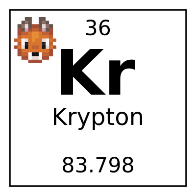

# Krypton Foxified

Krypton unofficial NeoForge port.

Krypton Foxified is a NeoForge mod that attempts to optimize the Minecraft networking stack. It derives from work
done in the [Velocity](https://velocitypowered.com/) and [Paper](https://papermc.io) projects.

Krypton derives itself from Ancient Greek _kryptos_, which means "the hidden one". This makes
it evident most of the benefit from Krypton is "hidden" but is noticeable by a server administrator.

[The wiki contains important information &ndash; read it](https://github.com/astei/krypton/wiki).

## Compiling / Releases

**CAUTION!** I do not provide any guarantees about Krypton's stability, compatibility with other mods,
ability to be used on every server, or support for every possible setup out there. Support
for this mod is provided on a "best-effort" basis. This is not my day job, it is a hobby
growing out of related work I've done. **You have been warned.**

Releases I deem reasonably stable can be found on [GitHub](https://github.com/ThinkingStudios/KryptonFoxified/releases),
[CurseForge](https://www.curseforge.com/minecraft/mc-mods/krypton-foxified), and on [Modrinth](https://modrinth.com/mod/krypton-foxified).
Development builds may be downloaded from Github Actions on this repo.

You can also compile the mod from source in the usual fashion.